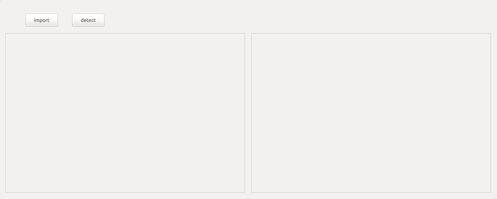

# stereo_detect
Object detection and stereo matching with Binocular pictures

This project provides the code for object detection and stereo matching, We could obtain the objects' 3d position information by above procedures.

* Object Detection : SSD.
* Stereo Matching : DispNet and Sgbm.

This project was done a long time ago, so it may be difficult to reproduce, I publish here for reference.

To run this code, we should install QT, Caffe(SSD、DispNet), Opencv(Sgbm).

I give a short introduction for the project files here:

* **camera.cpp/h** : This class restores the stereo camera parameters and provides the code for rectifing stereo images and obtaining the projection matrix.
* **detector.cpp/h** : This class encapsulates the SSD object detector with Caffe C++ interface, some codes are borrowed from the SSD detector.
* **match.cpp/h** : This class encapsulates the DispNet which takes the stereo images as input and outputs the disp map.
* **sgbmmatching.cpp/h** : This class encapsulates the sgbm algorithm to do stereo matching.
* **helper.cpp/h** : This class provides some help functions.
* **simpledemo.cpp** : Do object detection and stereo matching by above classes.

We provides two methods to obtain the disp map : dispNet may obtain smooth results but the absolute distance is not good; sgbm may obtain noise results but the absolute distance is better.

The project may run like below figure, left part shows the results on original image and right part shows the results on birdview image:

